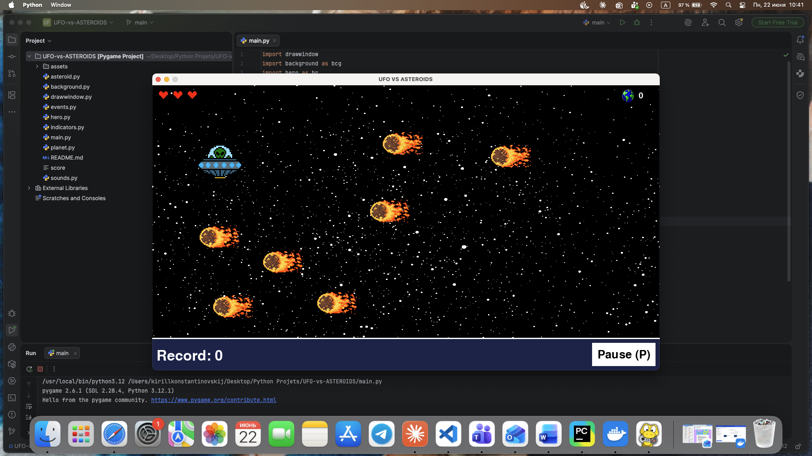
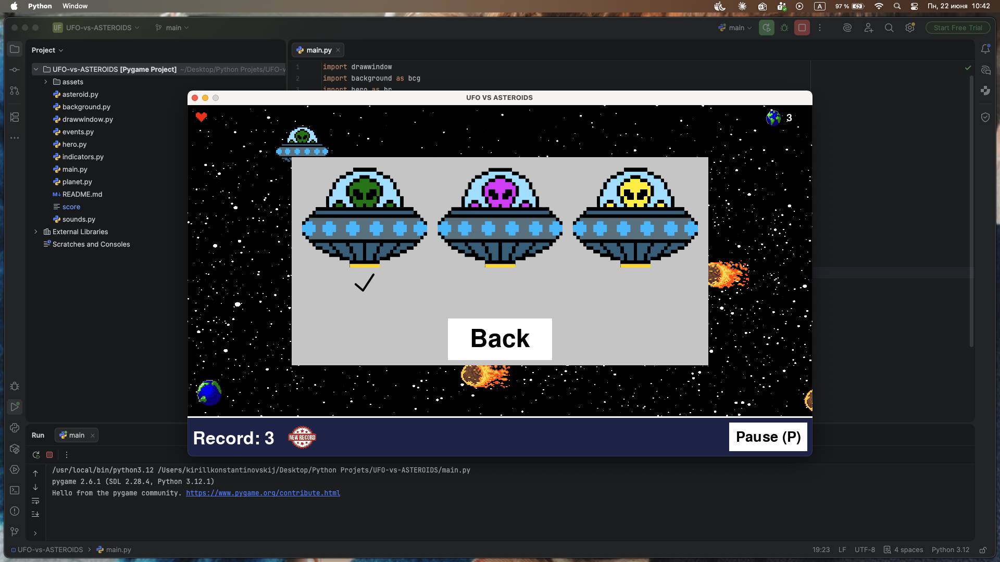

# UFO vs Asteroids

A space survival game built with Pygame. Pilot a UFO through an endless asteroid field, collect planets to score points, and survive as long as possible.

---

## Screenshots

<p align="center">
  
  
  
</p>

---

## Gameplay

- Asteroids and planets spawn on the right side of the screen and move left
- Collect planets by clicking on them to earn points
- Avoid asteroids — each hit costs 1 HP
- The game is infinite and ends when all 3 HP are lost
- High score is saved to disk and persists across sessions

## Controls

| Key / Input | Action |
|---|---|
| W A S D | Move UFO |
| Left Mouse Button | Collect planet |
| P | Pause menu |

---

## Features

- 3 HP health system with animated heart indicator
- Persistent high score saved to a local file
- Random spawn positions and speeds for asteroids and planets
- Animated sprites for asteroids, planets, and effects
- 3 UFO skins to choose from
- Background music and sound effects

---

## Tech Stack

| Layer | Tools |
|---|---|
| Language | Python 3 |
| Game Engine | Pygame |

---

## Project Structure

```
UFO-vs-ASTEROIDS/
├── assets/          # sprites, animations, sounds
├── main.py          # game loop and initialization
├── hero.py          # UFO player class
├── asteroid.py      # asteroid spawning and movement
├── planet.py        # collectible planet logic
├── indicators.py    # HUD — HP, score, high score
├── background.py    # background rendering
├── drawwindow.py    # display management
├── events.py        # event and input handling
├── sounds.py        # audio management
└── score            # persistent high score file
```

---

## Getting Started

**Requirements:** Python 3, Pygame

```bash
git clone https://github.com/Kirill-ark/UFO-vs-ASTEROIDS.git
cd UFO-vs-ASTEROIDS
pip install pygame
python main.py
```
